# West Yorkshire Piano Studio

This is a website for the West Yorkshire Piano Studio - a music business based in Leeds, UK. The website aims to give the user access to information about all the services on offer, an overview of the business and a way of contacting the business. Music lessons are the primary focus of the West Yorkshire Piano Studio. The site also aims to showcase some of the music that Ben performs with others and also a podcast that he produces.  

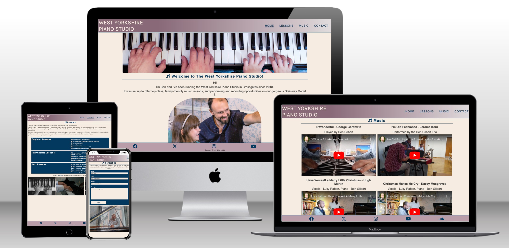

## Features

### Site wide
* Navigation Menu   
    * Contains links to the Home, Lessons, Music and Contact pages and is responsive on all devices utilising the burger icon for smaller screen sizes.
    * The user will easily be able to navigate between pages of the site on any device.
    * Clicking the West Yorkshire Piano Studio title will return the user to the homepage from anywhere on the site.

     

* Footer
    * This contains links to social media and music websites. Icons are accessible to people using a screen reader through the use of aria labels. ALl icons open into new tabs. The social media and music websites will enable the user to get a bigger picture about the West Yokrshire Piano Studio.
    
    

* Favicon
    * The site will use a favicon consisting of the West Yorkshire Piano Studios initials and in keeping with the websites colour scheme. 
    * This will make it easier to identify the site when users have a lot of browser tabs open.

    

* 404 Page
    * If a user navigates to a broken link then a custom 404 page will be displayed.
    * The user will be able to navigate back to the correct site through the menu or additional link. No need to use the browsers back button.

    

### Landing Page
* Images
    * As the main focus of the business is music lessons both images will be friendly and demonstrate that the West Yorkshire Piano Studio is a fun place to come and learn at.

     

* Text 
    * A brief introduction to the West Yorkshire Piano Studio, Ben Gilbert and the some of the services available. A link to the contact page also encourages the user to get in touch with further questions.

### Lessons Page
* Opening paragraph
    * Some exciting text to encourage users visiting the site looking for music lessons. 

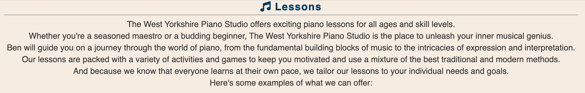

* Lesson Boxes
    * These contain examples of types of lessons that can be covered at the West Yorkshire Piano Studio. Split into three categroies and boxed to help separate the information.


* Images
    * A series of three images showing off the piano in the West Yokrshire Piano Studio.
    


### Music Page
* Iframes
    * A more interactive page for the user. Page uses 5 iframes, 4 containing youtube videos and one containing a podcast from podbean.com
    * Each iframe uses appropriate media controls as well as links to the external sites where more inforation is available.
    * An additional title is used above each iframe to give user information about it's content.
    * Another get in touch link encourages the user to navigate to the contact page.

    
    

### Contact Page
* Contact Form
    * A form to allow users to contact Ben at The West Yorkshire Piano Studio and enquire about music lessons, live music for events or further questions.
    * The form consists of the following fields and attributes all with placeholder text:
        * Name (required, type=text)
        * Email (required, type=text)
        * Mobile (required, type=phone)
        * Message (required, textarea)
    
    

    * When send is clicked and all fields have been completed the user will see thankyou.html displaying a success message. A 10 second timer is implemented to here to return the user to the homepage.

    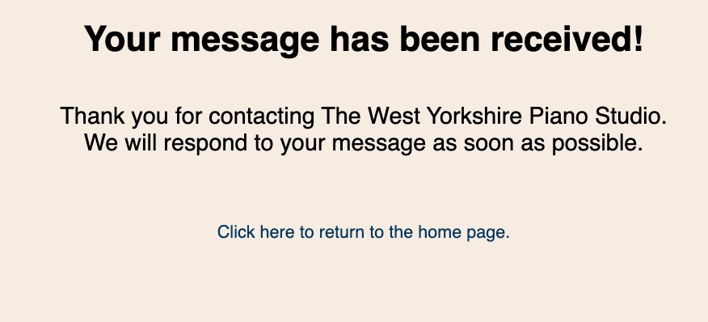

### Existing Features

* A fully responisve design - designed to work from screensizes greater than 280px.
* A crop down menu utilised when the burger icon is clicked on smaller screens.
* Contact form and confrimation (thank you) page.
* Images throughout the site.

## Design

### Wireframes

Home Page


Lessons Page


Music Page


Contact Page


## Technologies

* HTML
    * The structure of the Website was developed using HTML as the main language.
* CSS
    * The Website was styled using custom CSS in an external file.
* Visual Studio Code
    * The website was developed using Visual Studio Code IDE
* GitHub
    * Source code is hosted on GitHub and delpoyed using Git Pages.
* Git 
    * Used to commit and push code during the development opf the Website
* Font Awesome
    * Social media icons, burger/menu icon and music notes icon were obtained from https://fontawesome.com/.
* Google Fonts
    * The two fonts used (Merriweather and Karla) came from https://fonts.google.com/
* Webp Image converter
    * https://image.online-convert.com/ was used to convert images to .webp.
* Photos (Mac)
    * Used to resize photos throughout the site.
* Favicon.io
    * The favicon was created at https://favicon.io/favicon-generator/.
* Balsamiq
    * Wireframes were created using Balsamiq for Desktop https://balsamiq.com/wireframes/desktop/

### Testing

## Responsiveness

All pages were tested to ensure a responsive design was acheieved on screen sizes from 280px (Galaxy Fold) and upwards as defined in WCAG 2.2 Reflow Criteria (https://www.w3.org/TR/WCAG22/#reflow).

Steps to test:

1. Open Chrome browser and naviagte to https://bengilbertcodes.github.io/westyorkspiano/.
2. Right click and se;ect Inspect to open developer tools.
3. Set to Responsive and reduce the width to 280px and set zoom to 50%.
4. Click and drag to repsonsive window up to max-width.

Expected results:

The site is responsive on all screen sizes, no images and iframes are stretched.
No horizontal scroll is present.
No elelments overlap.

Actual Results:
The webiste meets all responsiveness criteria.

The website has also been checked in Firefox, Safari, Chrome and Edge browsers and the following devices:
- Google Pixel 3a
- Ipad Pro
- Iphone 13

### Accessibility 

The Wave Accessibility (https://wave.webaim.org/) tool has been used throughout development and for the final testing of the website.

No errors were reported accross the site. 

Alerts:

- For redundant links where Home in the nav menu is next to the clickable page title. I am happy to leave this as is.
- Copyright text is very small. Due to this being just a copyright note I am happy to leave this.
- Embedded Youtube videos are present - Ensure that synchronized captioning is available. Two videos do not need captioning and two with a singer don't have them. This is something I need to consider for future recordings. 

### Lighthouse Testing

index.html:


lessons.html:


music.html
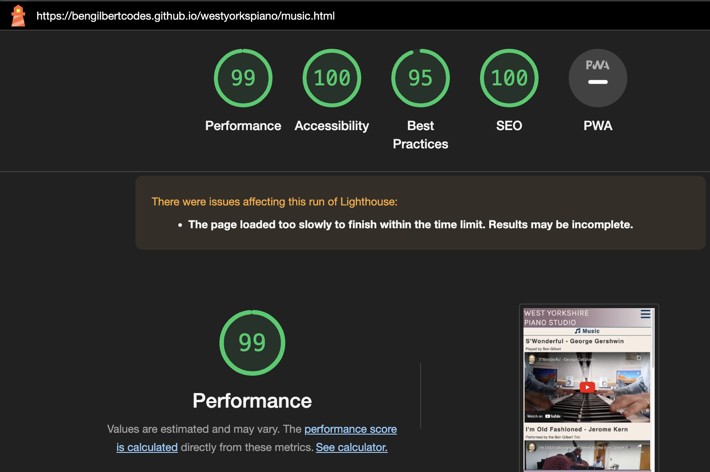

contact.html
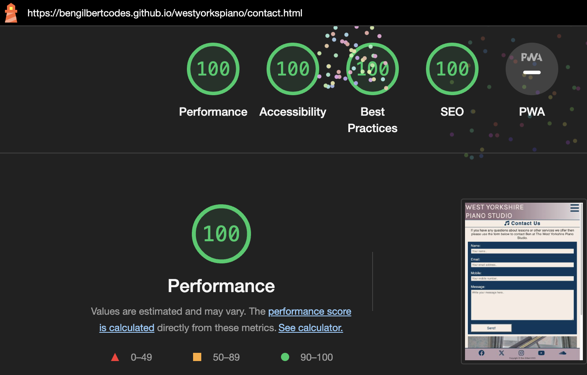

All pages achieve score of 100 with the exception of music.html. This is due to the use of iframes for the videos and podcasts. As they are essentially a page within a page this greatly affects loading times. I will address this issue for future developments by reducing iframe use.

## Functional Testing

### Navigation Links

All navigation links across the site have been tested to ensure they guide the user to their respective pages. 

All social media links open in new pages.

### Form Testing

The form on contact.html hes been tested to ensure it functions as expected when data is enetered by the user, either correctly or incorrectly.

* If all fields are completed correctly by the user, when Send is clicked the user is presented with the thankyou.html page and then redirected back to home.html after 10 seconds of inactivity. 
* If Name: field is not completed then form will not submit and 'Please fill in this field' message is displayed.
* If Email: field is not completed then form will not submit and 'Please fill in this field' message is displayed.
* If Email: field is completed but data is not in email format (a@b.c) then the form will not submit and 'Please include an @ in the email address' message is displayed.
* If Mobile: field is incommplete then form will not submit and 'Please fill in this field' message is displayed.
* If Mobile: field is completed using anything another than a string of 11 digits then form will not submit and 'Please match the format' massage is displayed
* If Message: field is incomplete then form will not submit and 'Please fill in this field' message is displayed.

## Validator Testing

* HTML

    • Index.html
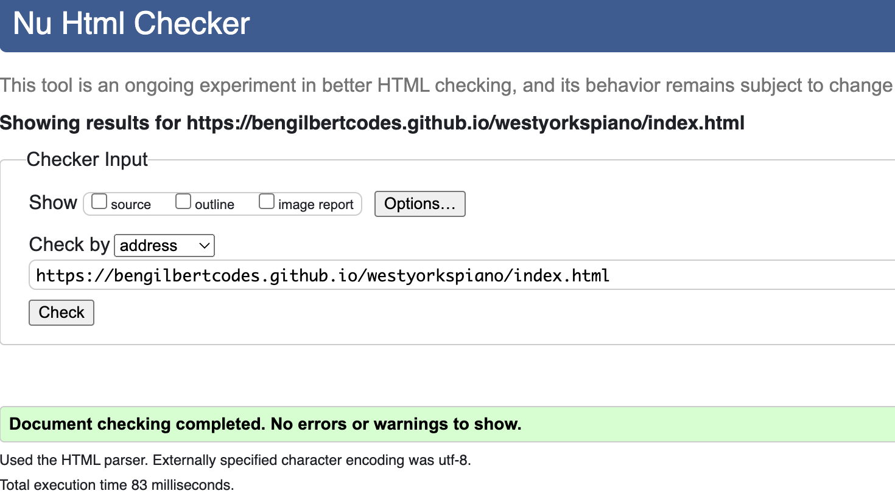

    • lessons.html
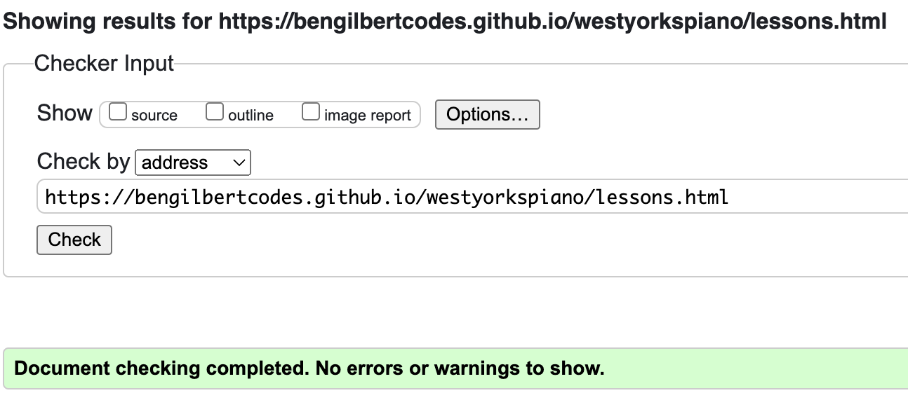

    • music.html
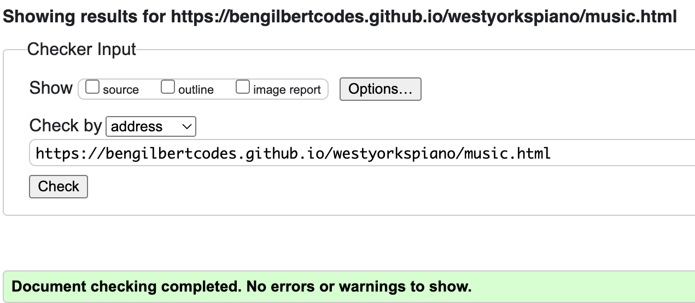

    • contact.html
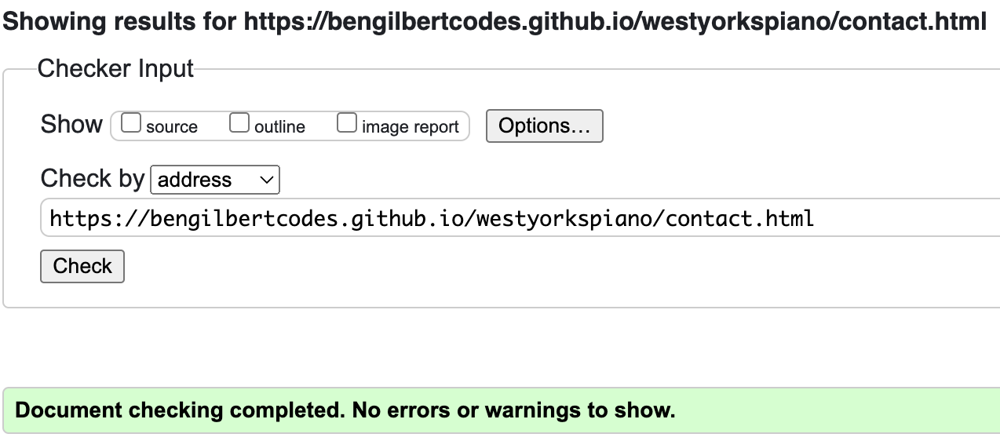

    • thankyou.html
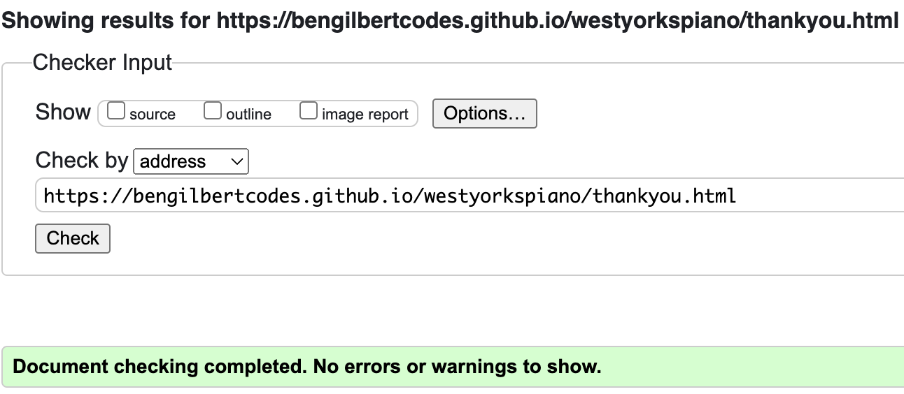

    • 404.html
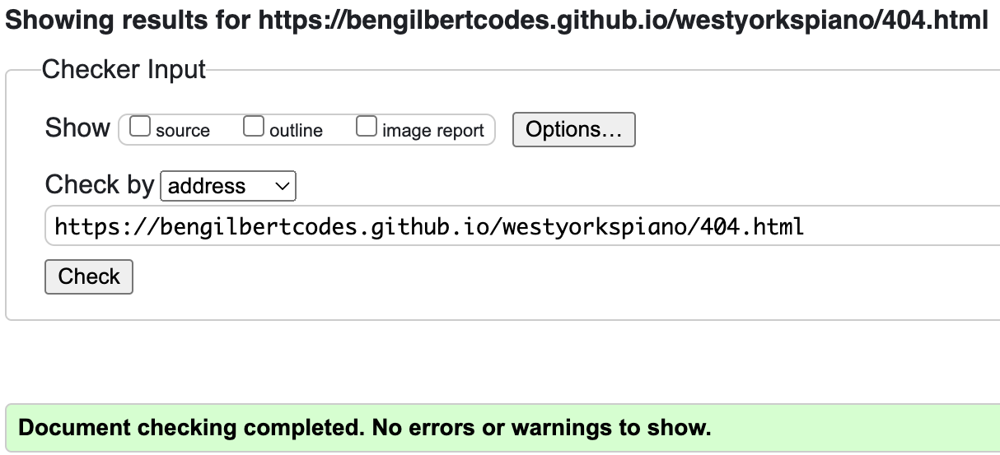

* CSS

    • No errors returned using the official Jigsaw Validator https://jigsaw.w3.org/css-validator/
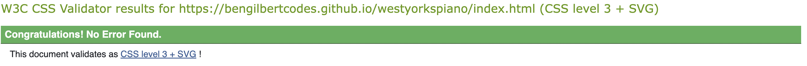

### Unfixed Bugs
There are no reported bugs to fix. 
Reducing use of Iframes recommeneded for future releases.
THe lessons-boxes don't adjust to different screen sizes at exactly the same time and at the time of writing this I haven't been able to correct this. 

## Deployment

### Version Control

The site was created using Visual Studio code editor and pushed to the remote repository 'westyorkspiano' on Github.

Code was pushed to the repository using Visual Studio's ```commit``` and ```commit & push``` commands.

### Deployment

The site was deployed to Github pages.

I used the following steps to deploy the site:

• Open the repository in github https://github.com/bengilbertcodes/westyorkspiano

• Click Settings and navigate to Pages

• Make sure Surce is set to 'Deploy from a branch' and the Branch is set to 'Main' and '/Root'

• Click Save

• The live site will be availble via the link or through Deployments on the main repository page.

• The live site: https://bengilbertcodes.github.io/westyorkspiano/

## Credits

* [Karen Gourlay Photography](https://www.facebook.com/KarenGourlayPhotography/)
    • All pictures used were taken by Karen Gourly Photography. Videos and podcast are all my own.

* [Burger Icon and Drop-down Menu toggle](https://github.com/Code-Institute-Solutions/love-running-v3/blob/main/3.7-creating-the-footer/index.html)
    • Thanks to the Code Institute Love Running walkthrough for the code for this element of the site.

All content is used on the site with the permission of the owners.